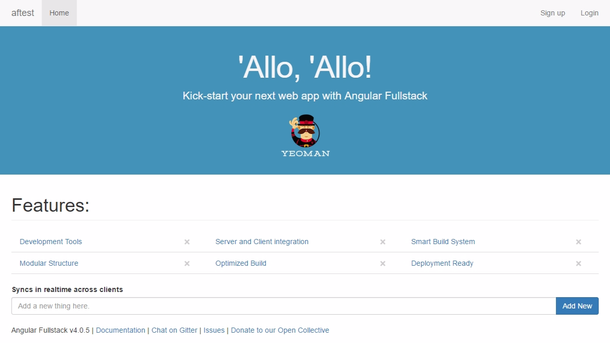

## Install & run the generator.

<div class="homepage__wrap">
<div class="homepage__left">

**Install Yeoman, generator-angular-fullstack, & the Gulp CLI**

```bash
$ npm install --global yo generator-angular-fullstack gulp-cli
```

</div><div class="homepage__right">

**Make a new folder for your project, scope into it, and run the generator.**

```bash
$ mkdir example && cd $_
$ yo angular-fullstack
...
```

Answer the generator's questions to scaffold an app tailored to your preferences.

</div>
</div>

## Get up and running

<div class="homepage__wrap">
<div class="homepage__left">

**Start the development server**

```bash
$ gulp serve
```

Your web browser should open up to a page similar to the one shown to the right.

</div><div class="homepage__right">



</div>
</div>
